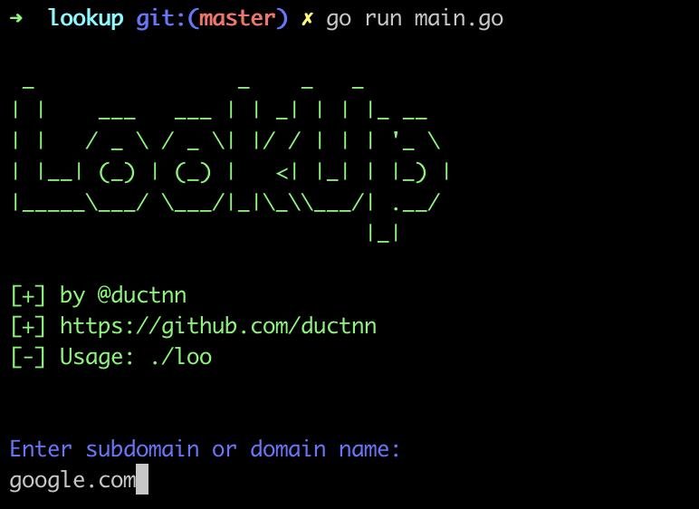
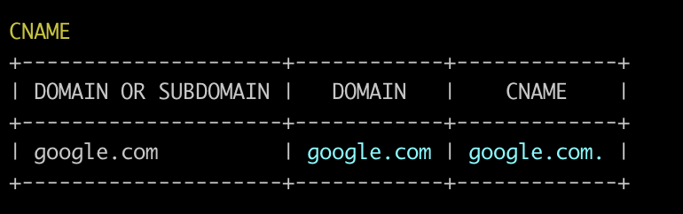
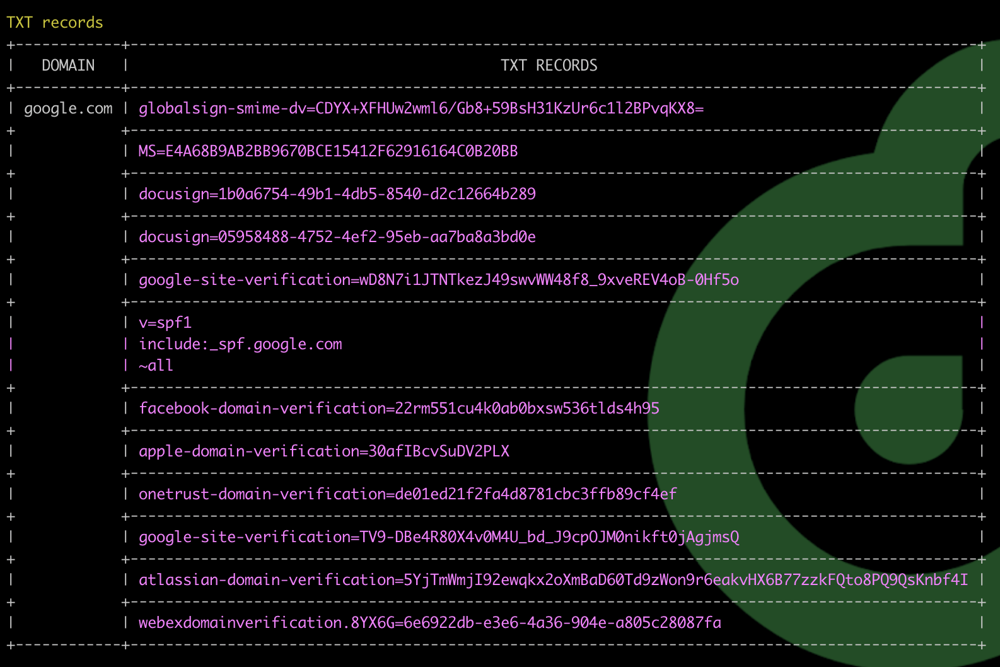
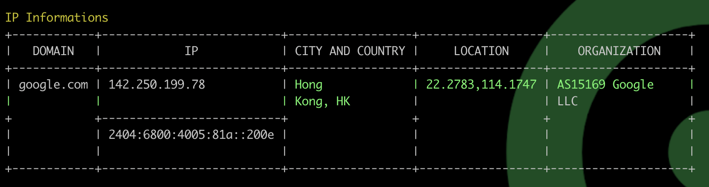
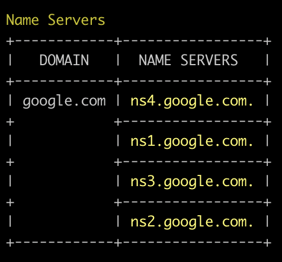
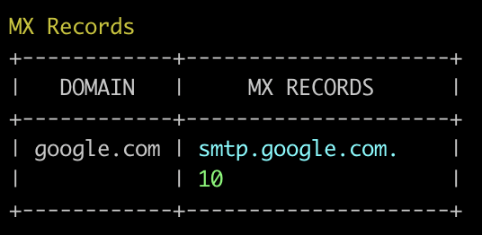

# LOOKUP

[](https://github.com/ductnn/lookup/pulls)
[](https://goreportcard.com/report/github.com/ductnn/lookup)
[](LICENSE)

**LOOKUP** is a simple tool check IP informations, CNAME, NS(Name Server), A records,
MX records, ... with **Go**.

```bash
     /\/| __   /\/| __
    |/\/ /_/  |/\/ /_/
      ___     ___
     / _ \   / _ \
    | (_) | | (_) |
     \___/   \___/
```

## Install

First, install [golang](https://go.dev/doc/install).

Then, clone from soucre code and setup:

```sh
git clone https://github.com/ductnn/lookup.git
cd lookup
go get
```

## Usage

### Without docker

Run command:

```
go run main.go
# Enter domain you want to check.
# Example
google.com
```

  <p align="center">
    
  </p>

Check result:

**CNAME**

  <p align="center">
    
  </p>

**TXT records**

  <p align="center">
    
  </p>

**IP informations**

  <p align="center">
    
  </p>

**Name Servers**

  <p align="center">
    
  </p>

**MX records**

  <p align="center">
    
  </p>

### With docker

Check [Dockerfile](Dockerfile) and build with command:

```sh
docker build -t <your-image> -f Dockerfile .
```

or pulls my image in [here](https://hub.docker.com/r/ductn4/loo), and run *container*

```sh
docker run -it ductn4/loo:v2
```

### With file binary

You can down file *binary* in [here](bin/loo) for running tool:

```sh
# Download file bin to your local
chmod +x loo
./loo
# And check result ...
```

Test with **facebook.com**:

```sh
➜  bin git:(master) ✗ ./loo

     /\/| __   /\/| __
    |/\/ /_/  |/\/ /_/
      ___     ___
     / _ \   / _ \
    | (_) | | (_) |
     \___/   \___/


Enter subdomain or domain name:
facebook.com

CNAME
+---------------------+--------------+---------------+
| DOMAIN OR SUBDOMAIN |    DOMAIN    |     CNAME     |
+---------------------+--------------+---------------+
| facebook.com        | facebook.com | facebook.com. |
+---------------------+--------------+---------------+

TXT records
+--------------+----------------------------------------------------------------------+
|    DOMAIN    |                             TXT RECORDS                              |
+--------------+----------------------------------------------------------------------+
| facebook.com | google-site-verification=A2WZWCNQHrGV_TWwKh6KHY90tY0SHZo_RnyMJoDaG0s |
+              +----------------------------------------------------------------------+
|              | v=spf1                                                               |
|              | redirect=_spf.facebook.com                                           |
+              +----------------------------------------------------------------------+
|              | google-site-verification=sK6uY9x7eaMoEMfn3OILqwTFYgaNp4llmguKI-C3_iA |
+              +----------------------------------------------------------------------+
|              | google-site-verification=wdH5DTJTc9AYNwVunSVFeK0hYDGUIEOGb-RReU6pJlY |
+--------------+----------------------------------------------------------------------+

IP Informations
+--------------+------------------------------------+------------------+------------------+------------------------+
|    DOMAIN    |                 IP                 | CITY AND COUNTRY |     LOCATION     |      ORGANIZATION      |
+--------------+------------------------------------+------------------+------------------+------------------------+
| facebook.com | 31.13.75.35                        | Hong             | 22.2783,114.1747 | AS32934 Facebook,      |
|              |                                    | Kong, HK         |                  | Inc.                   |
+              +------------------------------------+------------------+------------------+                        +
|              | 2a03:2880:f15a:83:face:b00c:0:25de | Dublin,          | 53.3331,-6.2489  |                        |
|              |                                    | IE               |                  |                        |
+--------------+------------------------------------+------------------+------------------+------------------------+

Name Servers
+--------------+--------------------+
|    DOMAIN    |    NAME SERVERS    |
+--------------+--------------------+
| facebook.com | b.ns.facebook.com. |
+              +--------------------+
|              | d.ns.facebook.com. |
+              +--------------------+
|              | a.ns.facebook.com. |
+              +--------------------+
|              | c.ns.facebook.com. |
+--------------+--------------------+

MX Records
+--------------+-----------------------------+
|    DOMAIN    |         MX RECORDS          |
+--------------+-----------------------------+
| facebook.com | smtpin.vvv.facebook.com.    |
|              | 10                          |
+--------------+-----------------------------+
```

## License
The MIT License (MIT). Please see [LICENSE](license) for more information.
