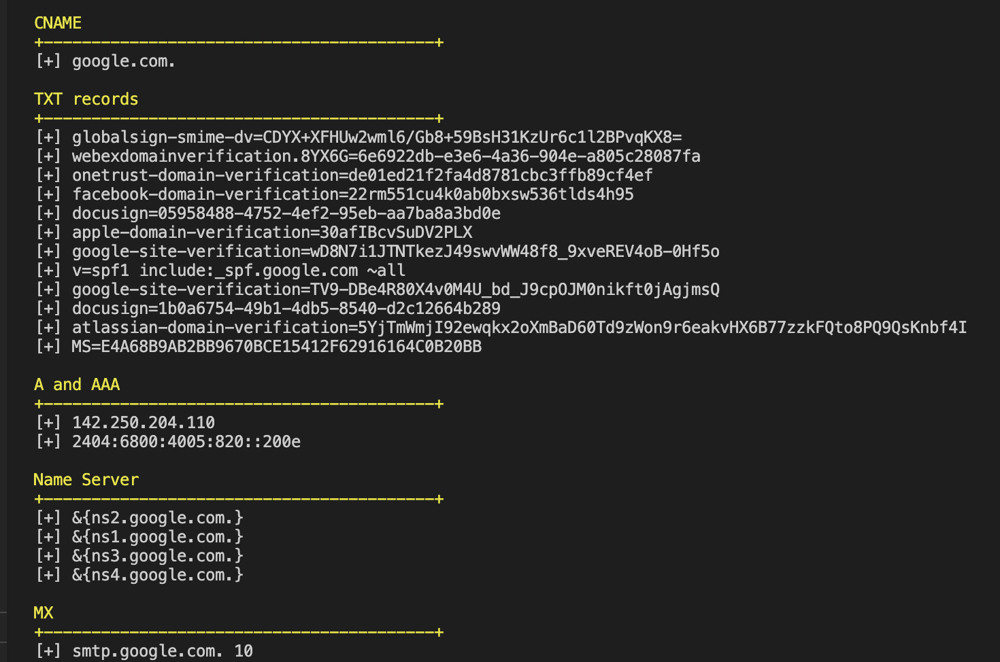

# LOOKUP

[](https://github.com/ductnn/lookup/pulls)
[](LICENSE)

**LOOKUP** is a simple tool check IP, NS(Name Server), A records, MX records, ...
with **Go**.

```bash
     /\/| __   /\/| __
    |/\/ /_/  |/\/ /_/
      ___     ___
     / _ \   / _ \
    | (_) | | (_) |
     \___/   \___/
```

## Install

First, install [golang](https://go.dev/doc/install).

Then, clone from soure code and setup:

```sh
git clone https://github.com/ductnn/lookup.git
cd lookup
go get
```

## Usage

### Without docker

Run command:

```
go run main.go
# Enter domain you want to check.
# Example
google.com
```

  <p align="center">
    
  </p>

Check result:

  <p align="center">
    
  </p>

### With docker

Check [Dockerfile](Dockerfile) and build with command:

```sh
docker build -t <your-image> -f Dockerfile .
```

or pulls my image in [here](https://hub.docker.com/r/ductn4/loo), and run *container*

```sh
docker run -it ductn4/loo
```

## License
The MIT License (MIT). Please see [LICENSE](license) for more information.
